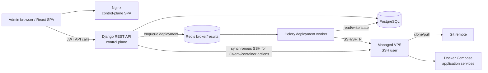

# Architecture and Current-State Audit

Audit date: 2026-07-23  
Scope: the complete repository at the audited revision, excluding generated dependency contents (`venv`) and compiled artifacts except where their presence is operationally relevant. Documentation and UI text were treated as claims, not implementation evidence.

## 1. Executive technical summary

LaunchPlatz currently implements an **admin-only, single-control-plane deployment tool for a narrow Django + React / Docker Compose workflow**. An administrator can register an SSH server, create a project tied to that server, manage an SSH Git credential and encrypted environment variables, explicitly clone/select/pull a repository, queue deployment or redeployment, inspect deployment history, cancel cooperatively, and inspect/start/stop/restart/remove Compose services and retrieve bounded live logs.

The deployment worker connects directly to the target over SSH, operates in `~/launchplatz/projects/{project_id}`, pulls the configured branch, writes `.env`, runs `docker compose build` and `up -d`, executes `python manage.py migrate` and `collectstatic` in one configured Compose service, restarts all services, and requires every service to report `running` and `healthy` (`deployments/services.py:39-274,277-410`). Failures after a commit change trigger a best-effort hard-reset/rebuild rollback.

**Classification: functional MVP.**

Evidence supporting that classification:

- Core CRUD, credential encryption, remote Git, asynchronous deployment, state tracking, cancellation, rollback, Compose control, a React operator UI, and focused tests are implemented—not placeholders (`projects/api/views.py:51-422`; `deployments/services.py:39-410`; `containers/services.py:27-250`; `frontend/src/App.tsx:19-38`).
- The runtime is containerized with PostgreSQL, Redis, a Django web process, Celery worker, and frontend (`compose.yml:1-68`; `compose.staging.yml:1-55`).
- It is not production-capable as a deployment platform without significant external setup: it does not provision servers, install Docker/Git, configure DNS, issue TLS certificates, configure an application reverse proxy, expose a project domain, manage networks, or back up platform/application state. `Project.domain` is stored but unused by execution (`projects/models.py:30`; no implementation reference beyond serializers/UI).
- It supports exactly one framework enum (`django_react`) and hard-codes Django management commands (`projects/models.py:17-27`; `deployments/services.py:197-202,358-370`).
- It has no organization/team/tenant ownership model; every platform API is restricted to the global Admin role (`Config/settings/base.py:93-110`; `coreapp/permissions.py:5-15`).
- Staging provides only localhost-bound frontend/backend containers and assumes an external host proxy/TLS setup (`compose.staging.yml:35-50`); its Nginx only serves the SPA and does not proxy application deployments (`frontend/nginx.staging.conf:1-16`).
- There are no CI workflows, managed backups, monitoring/metrics, webhook receiver, deployment notifications, upgrade process, or end-to-end deployment test against a real VPS.

The implemented core is useful for a trusted operator deploying pre-compatible repositories to pre-prepared VPSs. It is far below a general-purpose Coolify-class platform.

## 2. Technology stack

| Component | Technology | Version identifiable | Purpose | Relevant paths |
|---|---|---:|---|---|
| Backend | Python, Django | Python 3.13 image; Django 5.1.4 | Control-plane web/API and ORM | `Dockerfile.staging:1`; `requirements/production.txt:6`; `Config/settings/base.py` |
| API | Django REST Framework, drf-spectacular | DRF 3.16.1; spectacular 0.28.0 | JSON API and OpenAPI/Swagger | `requirements/production.txt:13-16`; `Config/urls.py:24-34` |
| Frontend | React, TypeScript, Vite | dependency versions are `latest`; Router ^7.18.1; Node 22 image | Admin SPA | `frontend/package.json`; `frontend/Dockerfile.staging:1-10`; `frontend/src/App.tsx` |
| Database | PostgreSQL | 17 Alpine | Control-plane persistent records | `compose.yml:16-27`; `Config/settings/production.py:26-35` |
| Test database | SQLite | bundled with Python | Django test execution only | `Config/settings/test.py:35-40` |
| Task queue | Celery | >=5.4,<6 | Asynchronous deployment worker | `requirements/production.txt:5`; `Config/celery.py`; `deployments/tasks.py` |
| Broker/result/cache service | Redis | 7 Alpine; client >=5,<7 | Celery broker/result backend; no Django cache configuration found | `compose.yml:29-38`; `requirements/production.txt:25`; `.env.example` |
| SSH | Paramiko | >=3.5,<5 | Direct server, Git, deployment, and container commands | `requirements/production.txt:20`; `servers/services.py`; `projects/git_services.py` |
| Secret cryptography | cryptography/Fernet | 45.0.7 | Encrypt server keys, Git keys, env values, SMTP password helper | `requirements/production.txt:4`; `servers/services.py:30-54`; `projects/environment_services.py:14-39` |
| Container runtime | Docker Engine + Compose v2 on target | not pinned/installed | Builds and runs managed applications | `deployments/services.py:58-62,185-208`; `containers/services.py` |
| Control-plane containers | Docker Compose | format supplied by installed Docker | Local/staging orchestration | `compose.yml`; `compose.staging.yml` |
| Backend WSGI | Gunicorn | >=23,<24 | Staging Django process | `requirements/production.txt:8`; `docker/entrypoint.staging.py:25-30` |
| Static files | WhiteNoise | >=6.8,<7 | Django static serving | `requirements/production.txt:9`; `Config/settings/base.py:20`; `Config/settings/production.py:23` |
| Frontend proxy/server | Nginx | 1.27 Alpine | Serve the control-plane SPA only | `frontend/Dockerfile.staging:10-13`; `frontend/nginx.staging.conf` |
| Authentication | Django auth + SimpleJWT blacklist | SimpleJWT 5.5.1 | Admin access tokens and rotating refresh cookie | `requirements/production.txt:15`; `Config/settings/base.py:96-119`; `coreapp/api/common/views.py` |
| Deployment tools | Git, SSH, Docker Compose, Django management commands | target-installed; unpinned | Pull/build/start/migrate/static/restart/health | `projects/git_services.py`; `deployments/services.py` |
| Logging | Python logging, rotating file handler; Gunicorn stdout | 10 MB × 5 backups for Django production log | Control-plane request/application logs | `Config/settings/production.py:58-91`; `coreapp/utils/logging.py` |
| Monitoring | No monitoring stack | absent | Only stored SSH check state and on-demand Compose health | `servers/models.py:24-28`; `deployments/services.py:226-255` |
| Notifications | Models and email utilities only | partial/not wired to deployment events | Generic settings/email support | `utility/models.py:25-49`; `coreapp/utils/email_utils.py`; no deployment caller |

## 3. System architecture

### Implemented components

- **Control plane:** one Django application stores users, servers, projects, credentials, variables, Git operations, deployments, and steps in PostgreSQL. It exposes an Admin-only REST API.
- **Deployment execution layer:** a Celery worker consumes Redis jobs and performs blocking Paramiko SSH/SFTP operations. There is no target-side agent.
- **Managed server layer:** a user-supplied SSH endpoint and unencrypted-at-use private key. The target must already provide Git, Docker and Compose. Repositories and generated credential files are placed under the SSH user's home directory.
- **Frontend:** a React SPA calls `/api/v1`, keeps the access token in module memory, refreshes through the HttpOnly cookie, and polls active deployment/container endpoints (`frontend/src/lib/api.ts:3-56`; `frontend/src/lib/polling.ts`).
- **Backend API:** DRF endpoints for dashboard/auth/server/project/Git/environment/deployment/container operations (`Config/api/v1/urls.py:6-15`).
- **Database:** PostgreSQL for control-plane state. No database service is provisioned for managed applications.
- **Workers:** a single generic Celery worker definition; no queues, scheduler/beat, concurrency controls per server, retry policy, or orphan-job reconciliation are configured.
- **Events/webhooks:** no inbound webhook implementation. Deployment begins only from API actions.
- **Reverse proxy:** Nginx serves only the control-plane frontend. No implemented application routing, domain binding, DNS automation, or TLS/ACME.
- **Storage:** PostgreSQL and Redis named volumes for the control plane; repository/application files, `.env`, Git deploy keys, images and volumes live unmanaged on each VPS.
- **Secrets:** four environment-supplied Fernet master keys encrypt selected database values. Plaintext is decrypted in the web/worker process and written to the target as `.env` mode 0600.
- **External integrations:** SSH, Git remotes, SMTP utility. No cloud, DNS, registry, source-provider OAuth, notification channel, or observability integration.

Not shown because not implemented: organizations, target agents, proxy/ACME/DNS, registries, managed databases, backup storage, metrics, webhooks, and notification delivery.

## 4. Deployment workflow

Prerequisite operations are important: project creation does **not** clone the repository or prepare the server. An admin must register a server, install its public key if generated, create the project, and invoke the synchronous Git clone action before deployment (`servers/api/views.py:53-61`; `projects/git_services.py:240-259`; `projects/api/views.py:321-422`).

| Step | Responsible component / symbol | Path | Inputs | Outputs | Failure handling | Mode |
|---|---|---|---|---|---|---|
| 1. Request | React deploy UI or API client; `ProjectViewSet.deploy/redeploy` | `frontend/src/pages/DeploymentsPage.tsx`; `projects/api/views.py:187-195` | Admin JWT, project ID | Calls `_start_deployment` | API error surfaced in UI | Sync HTTP |
| 2. Validate eligibility | `ProjectViewSet._start_deployment` | `projects/api/views.py:121-147` | Active project/server, cloned timestamp, archive state, broker config | Eligible project or 409/503 | Explicit categories; `git_cloned_at` is cached evidence, not a live path check | Sync |
| 3. Persist attempt | `_start_deployment`, `create_deployment_steps` | `projects/api/views.py:148-166`; `deployments/services.py:406-410` | Project/user snapshots, trigger | `Deployment` plus 10 pending steps | DB uniqueness prevents one active deployment per project; transaction handles creation | Sync transaction |
| 4. Queue | `run_deployment.apply_async` | `projects/api/views.py:167-185` | Deployment ID | Celery task ID, HTTP 202 | Queue exception marks deployment failed; no automatic retry | Sync enqueue / async execution |
| 5. Worker acquisition | `run_deployment` | `deployments/tasks.py:7-20` | Deployment ID | Loads project/server/user; calls runner | No task retry, missing-record handling, or worker-loss reconciliation | Async |
| 6. Connect/validate | `DeploymentRunner.run`; `RemoteDeploymentService.__enter__` inherited from `RemoteGitService` | `deployments/services.py:336-345,46-68`; `projects/git_services.py:103-155` | Encrypted server key, server endpoint, project | SSH/SFTP session, home/workspace; validates Git/clone/clean tree/Compose/Docker | Sanitized categorized errors; host keys use trust-on-first-use `AutoAddPolicy` | Async |
| 7. Pull | `pull_code` | `deployments/services.py:150-161` | Workspace, branch, optional Git key | Previous/current commit and branch | Fast-forward only; dirty/missing/mismatch errors; no webhook commit pinning | Async |
| 8. Generate environment | `generate_env` | `deployments/services.py:163-183`; `projects/environment_services.py:62-67` | Decrypted active project variables | Atomic remote `.env`, chmod 0600 | Temporary cleanup and categorized failure | Async |
| 9. Build images | `build` | `deployments/services.py:185-189` | Project Compose file | Built local target-host images | Timeout/cancellation/process-group termination; generic sanitized error | Async |
| 10. Start services | `up` | `deployments/services.py:191-195` | Compose project | `docker compose up -d` | Categorized failure; partial Compose state may remain | Async |
| 11. Migrate | `django_command("migrate --noinput")` | `deployments/services.py:197-202,358-364` | Configured Django service name | Schema mutations inside deployed app | Failure initiates rollback, but database migrations are not reversed | Async; **Django-coupled** |
| 12. Collect static | `django_command("collectstatic --noinput")` | `deployments/services.py:365-370` | Django service | Collected static files | Failure initiates rollback | Async; **Django-coupled** |
| 13. Restart | `restart` | `deployments/services.py:204-208,372` | Entire Compose project | All services restarted | Failure initiates rollback; causes additional downtime after `up` | Async |
| 14. Health gate | `health_check` | `deployments/services.py:226-255,373` | Compose service list and `ps` JSON | Success only if every declared service is running and explicitly healthy | Polls until timeout; services without healthchecks always fail | Async |
| 15. Complete | `DeploymentRunner.run` | `deployments/services.py:374-403` | Step results | Deployment success, duration, commit cache/history | Pipeline errors mark failed/cancelled; unexpected Python exceptions are not normalized/finalized | Async |
| 16. Roll back on pipeline error | `_rollback`; `RemoteDeploymentService.rollback` | `deployments/services.py:257-274,323-335,378-402` | Previous commit, only if code changed | Hard reset, rebuild/up, collectstatic, restart, health | Best effort; separate rollback status/category. Does not reverse DB migrations, restore volumes/data, or restore `.env`; rollback failure loses message detail | Async |
| 17. Availability | External network/proxy | **No implementation** | Domain/DNS/TLS/ports | User-visible application | The pipeline only proves Compose health. It neither configures `Project.domain` nor returns a deployed URL | Incomplete |

Additional constraints and unsafe/incomplete areas:

- Deploy and redeploy execute the same pipeline; there is no immutable release/image artifact, blue-green switch, preview environment, build cache policy, or zero-downtime strategy.
- Cancellation is cooperative between remote commands; a dead worker can leave `pending/running/cancelling` rows and remote processes indefinitely.
- Multiple projects on the same server can deploy concurrently; there is only a per-project database constraint.
- A failed migration can mutate the application database before code rollback.
- Remote commands are substantially quoted and validated, but the design still executes repository-controlled Compose builds and containers with the SSH user's Docker authority.

## 5. Data model

| Domain concept | State | Implemented model / relationship | Evidence and limitations |
|---|---|---|---|
| Users | Exists | `User` extends Django auth; global integer role | `coreapp/models.py:68-101`; no project/team ownership |
| Organizations/teams | Absent | None | No model, migration, membership, ownership FK, or tenant query scoping found |
| Projects | Exists | `Project -> Server`; archive metadata -> User | `projects/models.py:16-105`; globally unique name and exactly one server |
| Environments | Partially represented | `EnvironmentVariable -> Project`; no Environment entity | “Environment” means variables only; no production/staging/preview separation |
| Applications/services | Partially represented | `Project` plus runtime Compose service strings | No Application/Service model; service state discovered from Compose |
| Deployments | Exists | `Deployment -> Project/User`; `DeploymentStep -> Deployment` | `deployments/models.py:8-124`; snapshots and step status, but no artifact/release/log body |
| Servers | Exists | `Server`; reverse `projects` relation | `servers/models.py:7-73`; SSH endpoints only, no provisioning/capacity/agent |
| Repositories | Partially represented | URL/branch/encrypted key fields on `Project`; `GitOperation -> Project` | `projects/models.py:28-49,107-138`; no provider/account/repository entity |
| Domains | Partially represented | string field `Project.domain` | `projects/models.py:30`; validated/serialized but not applied to proxy/DNS/TLS |
| Environment variables | Exists | `EnvironmentVariable -> Project` | `projects/models.py:141-161`; encrypted values, API returns plaintext to admin |
| Credentials | Partially represented | encrypted server and project Git key fields | `servers/models.py:19`; `projects/models.py:42`; no reusable credential/vault/rotation metadata |
| Logs | Partially represented | `GitOperation.output`; deployment error/steps; file logs | No deployment command log model; container logs are fetched live and not stored |
| Databases | Absent as managed resource | Control-plane PostgreSQL only | No managed application database model, lifecycle, credential, or connection |
| Backups | Absent | None | No model, task, target, schedule, retention, or restore |
| Notifications | Partially represented | `NotificationSettings`; `SMTPSettings` | `utility/models.py:25-49`; no notification records or deployment-event calls |
| Audit log | Partially represented | `created_by/updated_by`, GitOperation, deployment snapshots | `coreapp/base.py:4-13`; no comprehensive append-only actor/action log |
| Containers | Absent as persisted model | Discovered dynamically through Compose | `containers/services.py:169-250` |
| Volumes/networks | Absent | None | Compose owns them outside the control-plane model |

Auxiliary geographic/site configuration models (`Country`, `State`, `City`, `Address`, `SiteSettings`, `SMTPSettings`, `NotificationSettings`) derive from the original boilerplate and are not deployment architecture entities (`coreapp/models.py:8-66`; `utility/models.py`).

## 6. Security architecture

### Authentication and authorization

- Authentication uses email/password through Django `authenticate`, rejects non-admin/inactive users, returns a one-hour access JWT, and places a seven-day rotating/blacklisted refresh JWT in an HttpOnly, SameSite=Lax cookie (`coreapp/api/common/serializers.py:8-21`; `coreapp/api/common/views.py:57-109`; `Config/settings/base.py:112-119`; `coreapp/api/common/cookies.py:4-18`).
- The SPA keeps the access token only in module memory and sends it as Bearer authentication (`frontend/src/lib/api.ts:3-56`). This avoids persistent browser storage, although active-page XSS could still read/use application state.
- Django password hashing/validators are used in normal environments and new passwords run `validate_password` (`Config/settings/base.py:39-54`; `coreapp/api/common/serializers.py:40-56`). MD5 is test-only (`Config/settings/test.py:42-44`).
- Authorization is global role checking. `IsAdmin` verifies authenticated, active, role=Admin (`coreapp/permissions.py:5-15`). There is no object-level permission, tenant ownership, organization, team, or project membership.
- Other role classes exist, but deployment APIs explicitly use only `IsAdmin`; their existence is not evidence of platform RBAC (`coreapp/permissions.py:17-29`).
- No API token/personal access token/service-account model exists.

### Credentials and secrets

- Server keys, Git keys and environment values use separate Fernet keys supplied in process environment (`servers/services.py:30-54`; `projects/git_services.py:23-49`; `projects/environment_services.py:14-39`). Production settings require them (`Config/settings/production.py:39-47`).
- Encryption is application-level symmetric encryption, not envelope encryption or a vault. Anyone with database ciphertext plus the environment master keys can decrypt all corresponding secrets. There is no rotation/version field.
- Server and Git private keys are write-only in normal serializers; generated server public keys are returned once (`servers/api/serializers.py:7-96`; `projects/api/serializers.py`).
- Environment variable API representations decrypt and return **all** values, including `is_secret=True`, to any Admin (`projects/api/serializers.py:129-151`). `is_secret` is presentation metadata, not access control.
- Generated `.env` is atomically renamed with mode 0600 (`deployments/services.py:163-183`), but plaintext remains on the managed server and may be consumed/exposed by Compose.
- Git deploy keys are written to `~/.launchplatz/keys` with restricted permissions during remote operations (`projects/git_services.py:185-220`). Host identity is learned with `StrictHostKeyChecking=accept-new`, while Paramiko itself accepts any first host key (`projects/git_services.py:103-105,215-220`; `servers/services.py:94-95`); there is no administrator-verifiable fingerprint.
- `SMTPSettings.password` is a plain model `CharField`; an encryption helper exists separately, but no model hook proves that this field is encrypted (`utility/models.py:25-37`; `coreapp/utils/smtp_config.py`). Treat SMTP-at-rest protection as insufficient evidence.

### Command, container and network security

- User-derived repository URLs, branches, paths, service names and commit hashes are quoted with `shlex.quote`; validators constrain repository URL, Compose relative path, env key, domain and service name (`projects/validators.py:14-94`; `projects/git_services.py`; `deployments/services.py:138-208`; `containers/services.py:102-250`). This materially reduces ordinary shell injection risk.
- Remaining high-impact boundary: repository-controlled Dockerfiles/Compose configuration execute on a server account with Docker access. Docker access is effectively host-root authority; no sandbox, policy validation, resource limits, allowed-image rules, privileged-mode denial, capability restriction, or per-project daemon is implemented.
- Compose project naming is implicit. Commands omit `--project-name`/`--project-directory`; isolation relies on Compose’s path-derived behavior. Network/port conflicts and shared external resources are not controlled.
- Server SSH users/keys can be shared among projects. Per-project Git keys are copied to the same account. No least-privilege target agent exists.

### Web security and auditing

- Production enables HTTPS redirect, secure session/CSRF cookies, proxy SSL header, explicit allowed hosts/origins, and CORS credentials (`Config/settings/production.py:4-23`). Development uses wildcard hosts (`Config/settings/development.py:5-7`).
- JWT-authenticated API writes do not rely on session cookies; refresh/logout endpoints accept the refresh cookie and are `AllowAny`. SameSite=Lax limits common cross-site POSTs, but no explicit CSRF binding/double-submit mechanism is implemented for the refresh endpoint (`coreapp/api/common/views.py:88-128`).
- No webhook endpoint exists, so webhook signature verification is absent rather than defective.
- Request middleware logs request metadata/errors, and models carry some actor fields, but there is no complete immutable audit stream for authentication, secret reads, container commands, server edits, or administrative user edits (`coreapp/utils/logging.py`; `coreapp/base.py:4-13`).
- `AdminUserSerializer(fields='__all__')` can expose and accept sensitive/internal user fields through the admin user CRUD surface, including the password hash and privilege fields; although Admin-only, this is an unnecessarily broad API boundary (`coreapp/api/admin/serializers.py:4-8`; `coreapp/api/admin/views.py:7-10`).

## 7. Operational architecture

| Area | Current implementation | Gaps / risk |
|---|---|---|
| Installation | README documents local Docker Compose and manual Python/PostgreSQL/Redis setup; scripts generate local/staging env secrets | No one-command host installer, bootstrap UI, target-server provisioning, prerequisite installation, firewall setup, or production reference topology |
| Initial control plane | Compose starts DB/Redis/web/worker/frontend; web waits for DB/Redis | No initial admin bootstrap automation identified beyond Django administration/manual commands |
| Initial managed server | Admin supplies IP/user/key; connection test authenticates only | Git/Docker/Compose and SSH authorization must be installed manually; no hardening or capacity checks |
| Upgrades | Rebuild/restart can be done manually | No documented/versioned platform upgrade, compatibility check, data migration rehearsal, rollback, or image release channel |
| Database migrations | Web entrypoints run `migrate --noinput` on every startup (`docker/entrypoint.py:23-27`; `docker/entrypoint.staging.py:22-24`) | Concurrent/restarted web migration coupling; no backup gate or migration rollback |
| Backup/recovery | Docker named volume persistence only | No automated PostgreSQL dump, Redis/state backup, secret-key backup guidance, off-site storage, application-volume backup, restore command, or restore test |
| Log retention | Production Django rotating file: 10 MB, five backups; container logs fetched live and bounded | No central aggregation/search; Compose/Gunicorn/Docker retention not configured; deployment command output not retained |
| Health checks | DB/Redis Compose healthchecks; SSH test; deployment checks target Compose health | Control-plane web/worker/frontend have no Compose healthchecks; no external availability test or periodic server check |
| Monitoring | Dashboard counts persisted states | No metrics, alerting, traces, heartbeat, queue depth, disk/capacity monitoring, certificate checks, or SLOs |
| Platform recovery | Docker restart policies in staging (`unless-stopped`) | No HA, worker job recovery, stale deployment reconciliation, Redis/DB failover, or disaster runbook |
| App recovery | Compose restart behavior is repository-defined; deploy rollback rebuilds previous commit | No continuous supervisor beyond Docker, release artifacts, database/volume restore, automatic rollback after later health degradation, or cross-server failover |
| Reverse proxy/TLS | External to the repository for staging; SPA Nginx only | Operator must independently configure public proxy and certificates; managed project domain is non-functional |

## 8. Testing and quality

### Test inventory

- **Backend:** 119 discovered Django tests across authentication/account/dashboard, server CRUD/credential/SSH mapping, project validation/archive, Git commands/API, environment encryption/migration/API, deployment API/history/pipeline logic, and container API/service behavior (`coreapp/tests`, `servers/tests`, `projects/tests`, `deployments/tests`, `containers/tests`).
- Most remote behavior is tested with mocks. Pipeline order, cancellation, rollback state, command quoting, health parsing, encryption round-trips, API permissions and response behavior have direct assertions.
- **Frontend:** seven Vitest cases in three utility modules (`frontend/src/lib/api.test.ts`, `format.test.ts`, `polling.test.ts`). No React component, route, browser, accessibility, or workflow tests.
- `deployment-demo` is a sample compatible application, not an automated end-to-end test.

### Coverage by category

| Category | Assessment |
|---|---|
| Unit tests | Meaningful backend service/model/validator coverage; small frontend utility coverage |
| Integration tests | DRF tests integrate routing/serializers/database, but remote SSH/Git/Docker and Redis/Celery are mocked or eager |
| End-to-end tests | Absent: no browser-to-worker-to-real-VPS test |
| Deployment tests | Pipeline runner unit tests exist; no actual Docker Compose deployment in CI |
| Security tests | Permission, credential encryption, malformed/tampered values, quoting validators and cookie properties are covered; no SAST/DAST/dependency/container scan, fuzzing, tenant tests, or hostile Compose tests |
| Infrastructure tests | Environment generator tests only; no Compose bring-up, Dockerfile build, migration-on-Postgres, proxy, backup/restore, or failure-injection tests |
| Linting/static analysis | Frontend ESLint and TypeScript scripts exist; no backend formatter/linter/type checker/security analyzer configuration |
| CI checks | No `.github/workflows` or other CI configuration found |
| Coverage measurement | No coverage configuration/report or enforced threshold found |

### Audit execution results

- `manage.py test` discovered 119 tests. In the checked-in local virtual environment, 60 passed and 59 errored because `whitenoise` was not installed when Django initialized middleware. This demonstrates the local environment is not synchronized with `requirements/production.txt`; it does **not** prove those 59 assertions fail with declared dependencies installed.
- From `frontend`, `npm test` passed 7/7 tests in 3 files, `npm run build` succeeded, and `npm run lint` completed with no errors and three `react-refresh/only-export-components` warnings. These are local audit results; no CI evidence independently supplies their status.

## 9. Technical debt and structural constraints

| ID | Description | Evidence | Affected components | Likely consequence | Severity | Refactor before expansion? |
|---|---|---|---|---|---|---|
| TD-01 | Global Admin-only ownership; no tenant aggregate | `coreapp/permissions.py:5-15`; domain models lack organization FK | All API/data/UI | Adding teams later requires schema ownership, query scoping, permission and migration changes across every resource | Critical | Yes |
| TD-02 | Project conflates application, environment, repository and deployment target | `projects/models.py:16-105` | Data model, UI, deployment | Cannot naturally support multiple environments, services, repos, targets, previews or promotion | Critical | Yes |
| TD-03 | Deployment pipeline hard-coded to Django + Compose | `projects/models.py:17-27`; `deployments/services.py:197-202,358-370` | Worker/deployment | Other frameworks/buildpacks/static apps require conditional branching or a new pipeline abstraction | High | Yes |
| TD-04 | Direct SSH orchestration with no target agent/state reconciler | `projects/git_services.py:103-183`; `deployments/tasks.py:7-20` | Worker/server ops | Network loss and worker death leave indeterminate remote/control-plane state; scaling and security are difficult | Critical | Yes |
| TD-05 | Domain is data-only; no proxy, DNS or ACME | `projects/models.py:30`; `frontend/nginx.staging.conf` | Routing/security/UX | A deployment can be healthy but unavailable; core PaaS feature set absent | Critical | New subsystem; model refactor likely |
| TD-06 | No release/artifact model; mutates a live checkout | `deployments/services.py:150-208,257-274` | Deployment/rollback | Non-reproducible deployments, weak rollback, downtime, drift and build inconsistency | High | Yes |
| TD-07 | Rollback is not transactional and cannot restore data | migration occurs at `deployments/services.py:358-364`; rollback at 257-274 | Deployment/app DB | Failed deploy can leave irreversible schema/data changes despite “rollback succeeded” | Critical | Yes |
| TD-08 | Symmetric master keys are global and unversioned | production settings and cipher services | Secrets/operations | Rotation is disruptive; DB+environment compromise exposes all secrets | High | Yes for vault/KMS-level capability |
| TD-09 | Trust-on-first-use SSH host identity | `servers/services.py:94-95`; `projects/git_services.py:103-105,215-220` | All remote execution | Initial MITM can capture/redirect privileged deployment access | High | Yes |
| TD-10 | Repository Compose has unrestricted Docker authority | `deployments/services.py:185-208` | Managed server security | Malicious/mistaken repo can mount host paths, run privileged containers or exhaust host | Critical | Yes |
| TD-11 | No server-level scheduling/capacity/resource model | only `Project.server` and per-project active constraint | Scheduler/workers/servers | Concurrent builds contend; no placement, quotas, capacity or rescheduling | High | Yes |
| TD-12 | Synchronous SSH in multiple API endpoints | `projects/api/views.py:300-422`; `projects/api/container_views.py:18-122`; `servers/api/views.py:88-93` | API availability | Slow/unreachable servers consume web workers; weak retry/observability | High | Yes |
| TD-13 | No event/webhook/provider abstraction | no routes/models/tasks found | Git/deploy integrations | No push-to-deploy, PR previews, provider status, OAuth or commit event provenance | High | New subsystem |
| TD-14 | No managed storage/database/backup abstractions | models and routes contain none | Data services/operations | Coolify-class databases, volumes, S3 backups and restores require new lifecycle domains | Critical | Yes/new subsystems |
| TD-15 | Deployment logs are too shallow | `DeploymentStep` stores status/error only; `_run_cancellable` discards successful output | Support/audit/UI | Operators cannot diagnose builds or retain execution evidence | High | Model/storage refactor |
| TD-16 | Unexpected runner exceptions are not finalized | `DeploymentRunner.run` catches only `DeploymentPipelineError`, lines 378-394 | Worker/history | Programming/DB errors can strand active deployments | High | No, but required early |
| TD-17 | Control plane lacks operational lifecycle | `compose.staging.yml`; no backup/monitor/upgrade/CI files | Platform operations | Unsafe upgrades and weak recovery make production operation fragile | High | Operational foundation required |
| TD-18 | Generic boilerplate admin serializer exposes all user fields | `coreapp/api/admin/serializers.py:4-8` | User/security API | Sensitive hashes/internal privilege fields can be exposed or mass-assigned by admins | High | No; fix before broader RBAC |
| TD-19 | Dependency reproducibility is weak | frontend dependencies use `latest`; Python uses a mix of exact/ranges | Builds/CI | Builds drift and regress without code changes | Medium | No, but pin before releases |
| TD-20 | No automated CI or real integration test | repository contains no workflow; tests mock remote layer | Quality/release | Regressions across Docker, PostgreSQL, Redis, Celery, SSH and UI are not gated | High | No, but required before expansion |

## 10. Evidence index

| Finding ID | Finding | Evidence path | Relevant symbol or line range | Confidence |
|---|---|---|---|---|
| F-001 | Platform is global Admin-only | `Config/settings/base.py`; `coreapp/permissions.py` | `REST_FRAMEWORK` 93-110; `IsAdmin` 5-15 | High |
| F-002 | One framework option, Django+React | `projects/models.py` | `Project.Framework` 17-27 | High |
| F-003 | Project directly owns one server/repo/domain/config | `projects/models.py` | `Project` 16-105 | High |
| F-004 | Server access is direct Paramiko SSH/SFTP | `projects/git_services.py` | `RemoteGitService.__enter__` 103-155 | High |
| F-005 | Repository must be cloned before deployment | `projects/api/views.py`; `projects/git_services.py` | `_start_deployment` 121-147; `_require_clone` 222-229 | High |
| F-006 | Deployments are queued through Celery/Redis | `projects/api/views.py`; `deployments/tasks.py` | 148-185; `run_deployment` 7-20 | High |
| F-007 | Deployment runs pull/env/build/up/migrate/static/restart/health | `deployments/services.py` | `DeploymentRunner.run` 336-403 | High |
| F-008 | Every Compose service must be explicitly healthy | `deployments/services.py` | `health_check` 226-255 | High |
| F-009 | Rollback resets code but not application data/schema | `deployments/services.py` | `rollback` 257-274; migration 358-364 | High |
| F-010 | Domain execution/proxy/TLS is absent | `projects/models.py`; `frontend/nginx.staging.conf`; repository-wide search | field 30; Nginx 1-16; no consumer found | High |
| F-011 | Control-plane staging expects external ingress | `compose.staging.yml` | localhost port bindings 35-50 | High |
| F-012 | Secrets use separate Fernet keys | `servers/services.py`; `projects/git_services.py`; `projects/environment_services.py` | cipher classes | High |
| F-013 | Secret environment values are returned plaintext to Admin | `projects/api/serializers.py` | `EnvironmentVariableSerializer.to_representation` | High |
| F-014 | SSH server host keys are auto-accepted | `servers/services.py`; `projects/git_services.py` | 94-95; 103-105 | High |
| F-015 | No tenant/team/org model or object ownership | all models/migrations | repository-wide model/migration search | High |
| F-016 | No managed database, backup or restore domain | all models/routes/tasks | repository-wide search; only control-plane DB exists | High |
| F-017 | No inbound webhook/signature flow | all URL/view files | repository-wide route/symbol search | High |
| F-018 | No deployment notification wiring | `utility/models.py`; `deployments` | settings models 25-49; no deployment caller | High |
| F-019 | Container logs are live, bounded and not persisted | `containers/services.py`; `frontend/src/pages/ContainersPage.tsx` | `logs` 235-250; UI disclosure | High |
| F-020 | Unexpected exceptions can strand deployments | `deployments/services.py` | catch/finalization 378-403 | High |
| F-021 | No target resource isolation policy exists | deployment/container services | direct `docker compose` commands | High |
| F-022 | No CI workflows found | repository tree / `git ls-files` | no `.github/workflows` entries | High |
| F-023 | Backend test suite discovered 119 tests; local dependency drift caused 59 setup errors | audit command output; `requirements/production.txt` | missing local `whitenoise`, declared at line 9 | High |
| F-024 | Frontend has only utility tests | `frontend/src/lib/*.test.ts` | 3 files / 7 test cases | High |
| F-025 | No end-to-end real deployment test exists | test tree; `deployment-demo` | demo is documentation/sample only | High |
| F-026 | Production Django logs rotate locally | `Config/settings/production.py` | `RotatingFileHandler` 58-91 | High |
| F-027 | Control-plane/application backup and recovery evidence is insufficient | Compose, docs, scripts | named volumes only; no backup task/script/runbook | High |
| F-028 | SMTP password encryption is not proven | `utility/models.py`; `coreapp/utils/smtp_config.py` | model password field 29; detached helper | Medium |
| F-029 | Access token is memory-only; refresh token is HttpOnly cookie | `frontend/src/lib/api.ts`; `coreapp/api/common/cookies.py` | 3-56; 8-18 | High |
| F-030 | General-purpose production maturity is unsupported | findings F-001 through F-027 | combined evidence | High |
